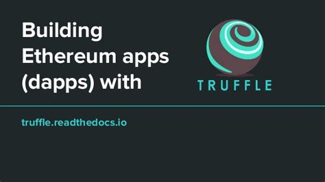
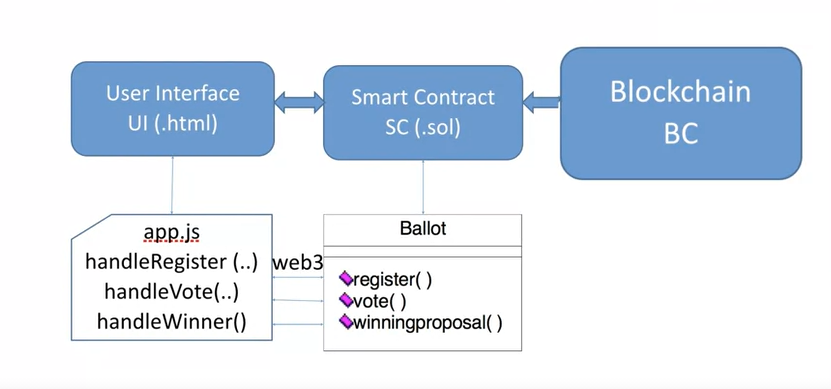
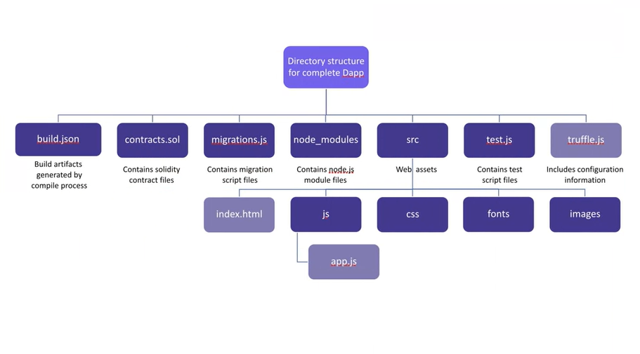
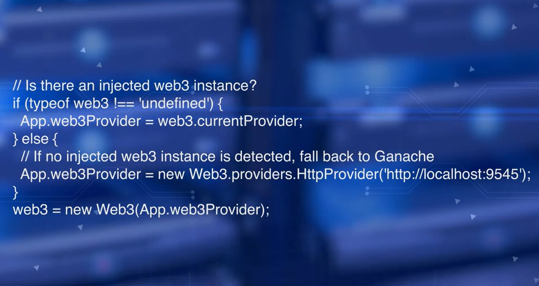
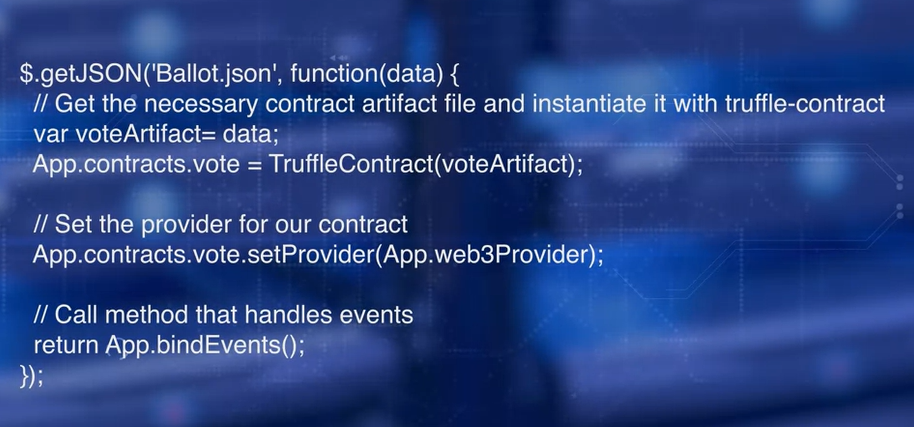
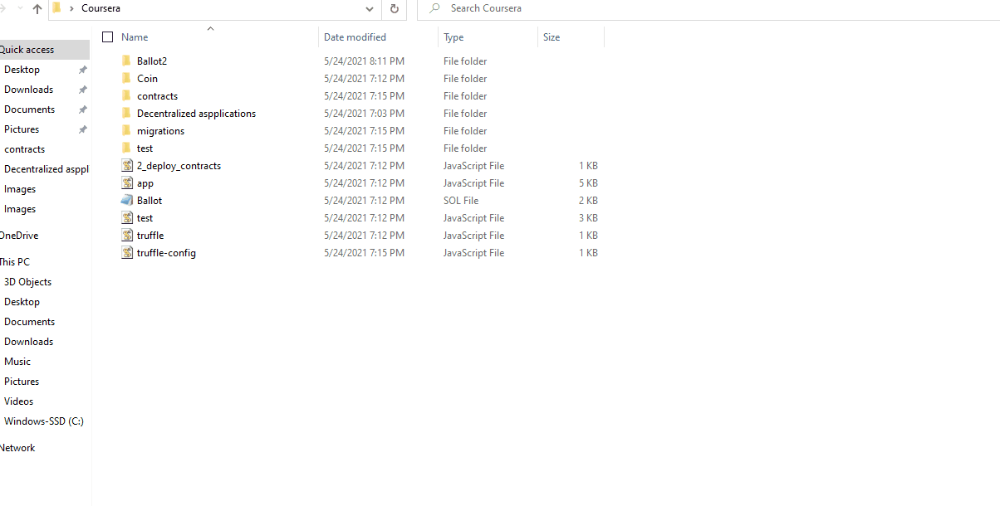
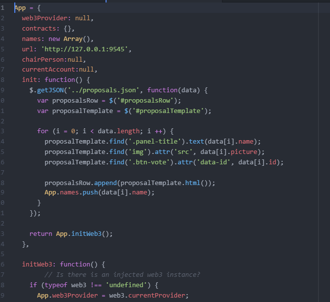
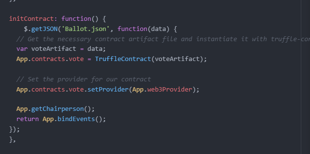
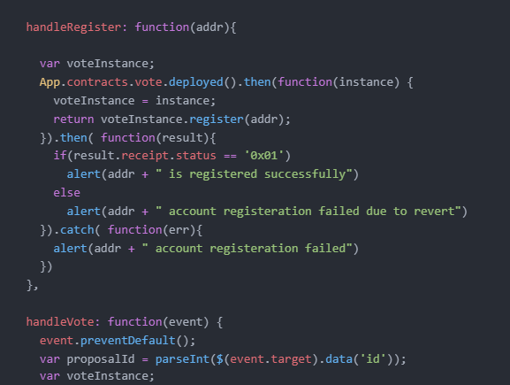
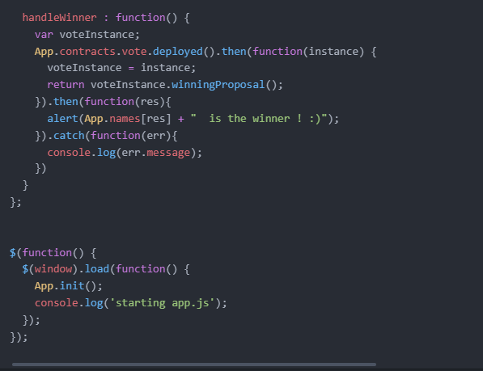

# WEB INTERFACE & TESTING

-------
add the web interface to the DApp.

In order to complete this we need ballot2 and related files. 

## Directory structure for complete Dapp

contract.sol files contains solidity contract files, and migration folder has migration scripts, Also, Test has the test scripts.Build has the JSON artifacts generated by the compile process.

Source folder has the web assets, such as JavaScript, CSS, and index HTML. Node module folder has the node.js modules. And JSON files and JavaScript are the configuration files.

## web 3 

We need to expose the blockchain accounts created through web3 provider object of the app.Simply put, web3 init code does that. It shows how web3 object is created and linked to the test chain we've applied.

Secondly, we need to tell the web3 where to find the smart contract artifacts.

Init contract method of the app.js does this.

To initialized further more we need to,

  01.truffle in it
  02.compile
  03.deployed
  04.tested it.
  
You can do git using ----> git bash here and to check what is inside the file we can use function call "ls"
and go to file we can use "cd" 
and go back to file we can use "cd .."

this steps shows how to use this.

### an app inside the src

#### web3

an app object that initializes the web3 object that is going to be the receiver of all the blockchain reports from your front-end application. And it's going to pass it on to your underlying RPC endpoint that you have opened up in your blockchain.

#### init contract

And then, there is also a init contract, that is init a web3 object. And that init contract, which is going to point out to all the artifacts that is needed for your smart contract, in this case Ballot.json. Beisdes that, we have other support functions.

#### handleRegister

handles the register function of your smart contact. handleVote, that's a glue for your vote function of your smart contract.

#### handleWinner

that is a Function that handles the winningProposals of your smart contract. 

#### truffle test

truflle test can compile,can deploy -----> can do all that in one command truffle test

